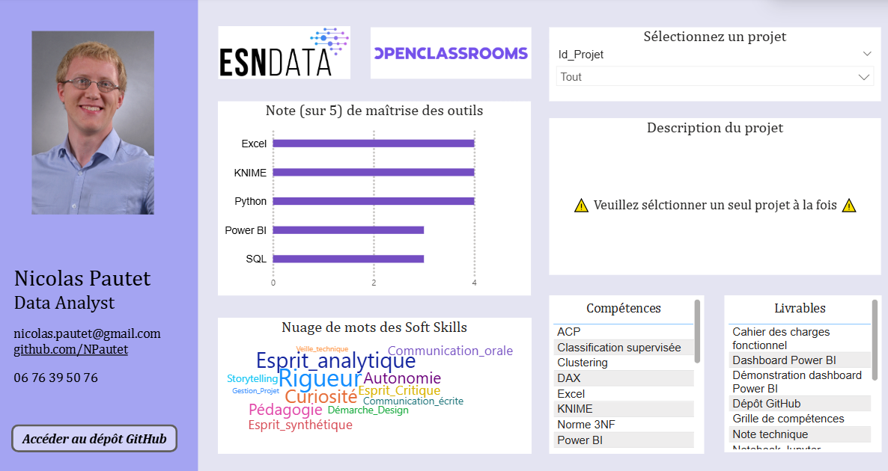
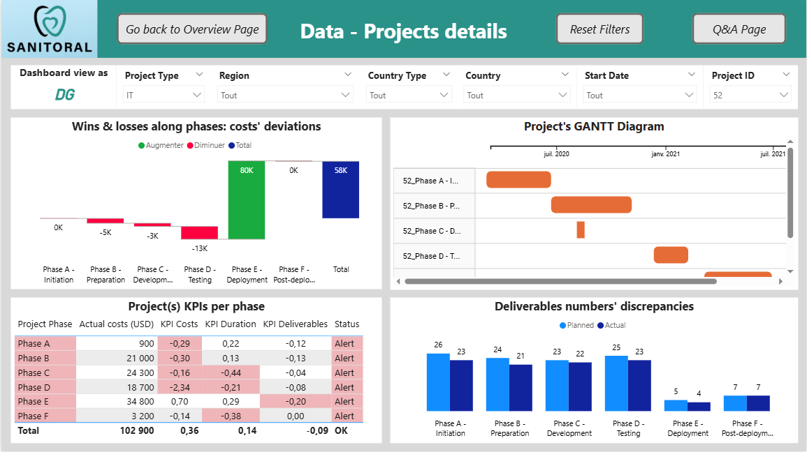
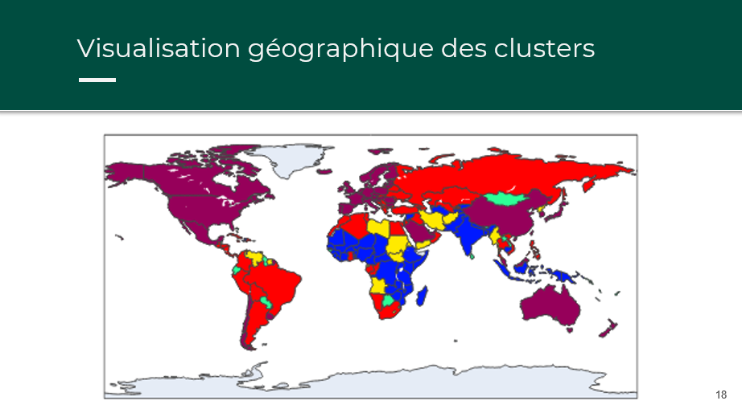

# Portfolio Data Analyst

Bienvenue sur le dépôt GitHub de mon portfolio de Data Analyst. Vous trouverez dans ce dépôt les différents projets que j'ai réalisés dans le cadre de ma formation avec OpenClassrooms au cours de l'année 2025. Ces projets couvrent les aspects essentiels du métier de Data Analyst.

Les projets réalisés illustrent mes compétences-clés comme l'analyse de données, la visualisation de données (grâce à des bibliothèques graphiques et des tableaux de bord), ainsi que la modélisation, la création et la manipulation de bases de données. Lors de cette formation, j'ai découvert ou amélioré ma maîtrise des outils Data comme Python (bibliothèques Pandas et sklearn), SQL, Excel et Power BI.

## Rappel des besoins client

En analysant attentivement son offre de recrutement, j'ai dégagé les principaux besoins métier en matière de Data de l'entreprise Aéroworld :

**Besoin métier 1 : valorisation et exploitation de la donnée** 
Tirer de la donnée une intelligence opérationnelle et stratégique : 
- modéliser et analyser des KPIs métiers, par exemple pour la conception des avions, l’optimisation des performances opérationnelles, la sécurité des vols
- réaliser des analyses prédictives (maintenance prédictive par exemple)
- développer des dashboards stratégiques  

**Besoin métier 2 : structuration et gouvernance de la donnée** 
Maîtriser le cycle de vie de la donnée pour fiabiliser les décisions et réduire les silos : 
- dresser une cartographie des sources avec définition des flux
- mettre en place un modèle de données cohérent
- participer à la création d’une infrastructure type Data Lake  

**Besoin métier 3 : sécurité et conformité de la donnée** 
Sécuriser les données sensibles sans entraver l'innovation : 
- participer à la définition des règles d’accès et de confidentialité
- réaliser une veille sur les règles, normes (RGPD, ISO 27001) et outils en matière de sécurité des données  

**Besoin métier 4 : pilotage global et transformation culturelle** 
Transformer l'organisation pour en faire une entreprise "data-driven" : 
- participer aux démarches d’harmonisation à l’échelle du groupe des sources de données et des pratiques (par exemple en matière d’analyse de données)
- accompagner le développement de la culture de la donnée pour l’ensemble des collaborateurs du groupe par la vulgarisation, la pédagogie
- en particulier pour les décisions stratégiques, les justifier par des analyses rigoureuses et des visualisations claires  

## Pertinence des projets du portfolio vis-à-vis des besoins client

| Projet | Besoin Métier 1 | Besoin Métier 2 | Besoin Métier 3 | Besoin Métier 4 |
|-----------:|:-----------:|:-----------:|:-----------:|:-----------:|
|[P02](https://github.com/NPautet/Portfolio-Data_Analyst/tree/main/P02_Ventes_E-Commerce)|✅|||✅|
|[P03](https://github.com/NPautet/Portfolio-Data_Analyst/tree/main/P03_Requ%C3%AAtes_SQL)||✅|||
|[P04](https://github.com/NPautet/Portfolio-Data_Analyst/tree/main/P04_%C3%89tude_FAO)|✅||||
|[P05](https://github.com/NPautet/Portfolio-Data_Analyst/tree/main/P05_DATAImmo)||✅|✅|✅|
|[P06](https://github.com/NPautet/Portfolio-Data_Analyst/tree/main/P06_Bottleneck)|✅|||✅|
|[P07](https://github.com/NPautet/Portfolio-Data_Analyst/tree/main/P07_Sanitoral)|✅||✅|✅|
|[P08](https://github.com/NPautet/Portfolio-Data_Analyst/tree/main/P08_%C3%89galit%C3%A9Pro_FH)|||✅|✅|
|[P09](https://github.com/NPautet/Portfolio-Data_Analyst/tree/main/P09_Ventes_Librairie)|✅|||✅|
|[P10](https://github.com/NPautet/Portfolio-Data_Analyst/tree/main/P10_%C3%89tude_DWFA)|✅|||✅|
|[P11](https://github.com/NPautet/Portfolio-Data_Analyst/tree/main/P11_%C3%89tude_march%C3%A9_Poulet)|✅|||✅|
|[P12](https://github.com/NPautet/Portfolio-Data_Analyst/tree/main/P12_Faux_Billets)|✅||||
|[P13](https://github.com/NPautet/Portfolio-Data_Analyst/tree/main/P13_Portfolio)||||✅|

## Mon profil

Les projets réalisés illustrent mes compétences-clés pour répondre à ces besoins métiers : l'analyse de données, la visualisation de données (grâce à des bibliothèques graphiques et des tableaux de bord), ainsi que la modélisation, la création et la manipulation de bases de données. 
J'ai rassemblé sous forme de tableau de bord l'ensemble des projets Data que j'ai menés, et je vais développer ci-dessous les projets les plus pertinents vis-à-vis des besoins métiers Data d'Aéroworld.

## Principaux projets réalisés

### [P07 - Créer un tableau de bord dynamique avec Power BI pour visualiser l'avancement de projets](https://github.com/NPautet/Portfolio-Data_Analyst/tree/main/P07_Sanitoral)

En tant que Data Analyst consultant, je suis chargé de mettre en place pour une entreprise cliente un tableau de bord permettant de suivre l'avancement de ses projets à l'international au travers de 3 KPIs, concernant le suivi temporel des plannings, les coûts engagés et le nombre de livrables réalisés. Le but est de construire un outil dynamique, destiné à des utilisateurs n'ayant pas les mêmes droits d'accès aux données, et qui ont des attentes différentes vis-à-vis de l'outil.

Tâches réalisées :
- Identification des besoins des utilisateurs 
- Explicitation des *User Stories* dans un *Product Strategy Canvas* (démarche de design)
- Préparation des données
- Création de mesures DAX personnalisées
- Développement de visualisations répondant aux *User Stories*
- Production de reportings avec différents niveaux de granularité pour faciliter la prise de décisions à différents niveaux hiérarchiques

### [P05 - Créer une base de données immobilière avec SQL](https://github.com/NPautet/Portfolio-Data_Analyst/tree/main/P05_DATAImmo)

En tant que Data Analyst dans un réseau national d'agences immobilières, il m'a été confié de mettre en place une base de données permettant de collecter les données de transactions immobilières en France. Cette base de données m'a ensuite servi à analyser le marché sur une période donnée pour aider les agences régionales à mieux accompagner leurs clients.  

Tâches réalisées :  
- Création d'un modèle de données (MCD puis MLD) cohérent avec les besoins métiers et en respect du RGPD
- Création d'une base de données en respect des bonnes pratiques (normes 3NF) et des besoins clients
- Requêtes SQL avancées pour répondre à une problématique métier

### [P08 - Analyser les indicateurs de l'égalité professionnelle femmes/hommes en respect du RGPD](https://github.com/NPautet/Portfolio-Data_Analyst/tree/main/P08_%C3%89galit%C3%A9Pro_FH)

Je suis en charge d'automatiser la création d'un rapport sur l'égalité professionnelle femmes/hommes au sein de mon entreprise, en utilisant le logiciel de programmation visuelle (no code) KNIME, via la mise en place d'un workflow complet à partir de données RH des salariés de l'entreprise. Ce workflow doit permettre de produire un rapport détaillé expliquant le score obtenu pour chaque indicateur de l'index global, ainsi que des graphiques pertinents expliquant de façon visuelle les potentielles pistes d'amélioration du score de l'index global.

Tâches réalisées : 
- Création d'un workflow complet de traitement des données conforme aux textes légaux
- Collecte des données pertinentes dans le respect des normes et bonnes pratiques (RGPD)
- Agrégation des extractions de données en définissant les règles de nettoyage pour chaque indicateur
- Vérification de la cohérence et la fiabilité des données préparées pour chaque indicateur
- Production de visuels explicatifs proposant des pistes d'amélioration du score de l'index

### [P09 - Analyser les ventes d'une librairie avec Python](https://github.com/NPautet/Portfolio-Data_Analyst/tree/main/P09_Ventes_Librairie)

En tant que Data Analyst pour une librairie en ligne, je dois produire une analyse des KPIs des ventes et essayer d'établir des segments clients cohérents à partir des données de ventes.

Tâches réalisées : 
- Analyse de séries temporelles
- Tests statistiques sur les données afin de tester et valider des hypothèses quant au lien entre certaines variables

### [P11 - Produire une étude de marché avec Python](https://github.com/NPautet/Portfolio-Data_Analyst/tree/main/P11_%C3%89tude_march%C3%A9_Poulet)

En tant que Data Analyst dans une entreprise française qui commercialise de la viande de poulet, je dois produire une étude de marché pour identifier de potentielles opportunités commerciales à l'international. J'ai une totale liberté sur les données avec lesquelles je peux travailler, si ce n'est la cohérence et la pertinence de ma démarche (méthode PESTEL). Je dois identifier, collecter, nettoyer et analyser les données pour les pays du monde, puis regrouper les opportunités en clusters.

Tâches réalisées :
- Définition des données étudiées par la méthode PESTEL
- Collecte et nettoyage des données
- Réalisation d'analyses bivariées pour comprendre la corrélation entre les variables
- Réalisation d'une Analyse en Composantes Principales (ACP) pour réduire la dimension du jeu de données et optimiser le temps d'apprentissage des modèles
- Utilisation et comparaison de plusieurs méthodes de clustering pour segmenter les ooportunités

### [P12 - Détecter des faux billets avec Python](https://github.com/NPautet/Portfolio-Data_Analyst/tree/main/P12_Faux_Billets)

Je travaille pour une organisation institutionnelle, l'Organisation Nationale de lutte Contre le Faux-Monnayage (ONCFM). J'ai pour mission de tester, d'optimiser et de comparer des modèles prédictifs supervisés permettant d'authentifier (ou non) des billets de banque à partir de leurs mesures géométriques.

Tâches réalisées :
- Analyse des distributions des variables selon l'authenticité des billets
- Utilisation et comparaison de modèles de régression linéaire pour imputer les valeurs manquantes du dataset
- Mise en œuvre de modèles d'apprentissages supervisés pour réaliser des prédictions
- Comparaison des modèles prédictifs étudiés par validation croisée et grâce à la définition d'une métrique pertinente
